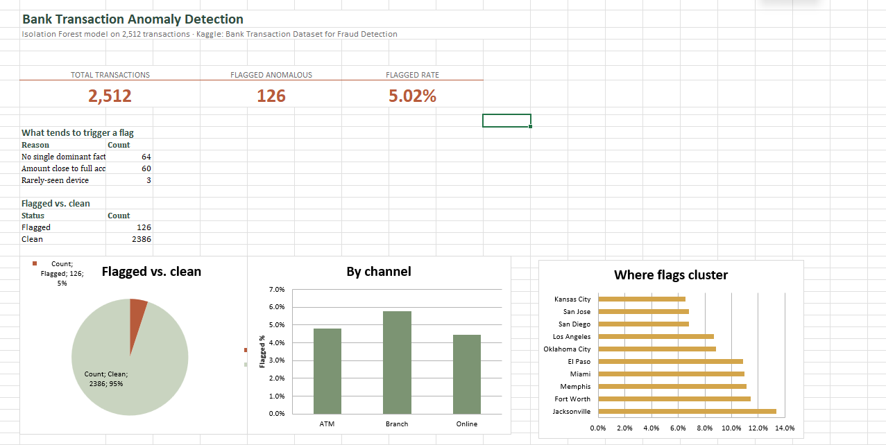

# Bank Transaction Anomaly Detection

A self-directed project applying unsupervised anomaly detection to bank transaction data — the kind of risk-monitoring logic an Operations team uses when there's no pre-existing fraud label to train against, only patterns worth flagging for review.

## Dataset
[Bank Transaction Dataset for Fraud Detection](https://www.kaggle.com/datasets/valakhorasani/bank-transaction-dataset-for-fraud-detection) (Kaggle) — 2,512 bank transactions with transaction amount, channel, location, device, login attempts, account balance, and timing fields. No fraud label, so detection had to be unsupervised.

> Raw data is not included in this repo (Kaggle-licensed) — download it directly from the link above and place it as `transactions.csv` in this folder to reproduce results.

## What this project does
1. **Feature engineering**: derives risk signals from raw fields — amount relative to account balance, hours since the account's last transaction, hour of day, and how frequently a device has been seen before.
2. **Isolation Forest**: an unsupervised model trained on those features flags the most unusual ~5% of transactions, with no fraud label used or needed.
3. **Reason tagging**: every flagged transaction is annotated with a plain-English reason (large amount, high login attempts, odd-hour activity, rare device, or "no single dominant factor" when the model caught an unusual combination rather than one obvious signal).
4. **SQL cross-check**: an equivalent rule-based query (`anomaly_flags.sql`) reproduces the same logic without ML, as a sanity check and a plainer way to explain *why* something got flagged.

## Key findings
- **126 of 2,512 transactions (5.02%)** flagged as anomalous.
- The two leading drivers: **60 transactions** flagged for an amount close to draining the full account balance, and **64** flagged for no single dominant factor — a genuinely multivariate signal the model caught that a simple rule wouldn't.
- **Geographic concentration**: the top 5 flagged locations (Jacksonville, Fort Worth, Memphis, Miami, El Paso) run at **10.9%–13.3% flagged**, more than double the 5.02% overall average. Those 5 cities hold just 12% of all transactions but account for **28% of all flagged ones** — a real concentration, not noise spread evenly across the map.
- Channel showed a smaller effect: Branch transactions flagged slightly more often (5.76%) than Online (4.44%).

## Tools
Python (pandas, numpy, scikit-learn) · SQL · Excel (dashboard)

## Files
- `anomaly_detection.py` — main analysis script (feature engineering + Isolation Forest)
- `anomaly_flags.sql` — equivalent rule-based logic in SQL
- `anomaly_dashboard.xlsx` — dashboard summarizing findings (screenshot below)
- `README.md` — this file

## Dashboard

